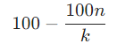

## Фаер - нейросеть для предсказаний турниров по overwatch
# Цель:
Создать нейросеть которая будет предсказывать вероятность выйграша в следующем раунде по турниру overwatch.
# Итог:
Нейросеть успешна работает и стабильно работает.
# Немного о нормализации данных:
Нейросеть все ещё в процессе доработке так как стабилизация данных немного страдает.

Так же при выводе пришлось операться на немного переделаную формулу вероятности:

Где n - все равновозможных исходов, а k - количество элементарных исходов, благоприятствующих событию.

Из-за этого будут возникать неточности в предсказании модели.
# Цель на будующее:
1. Переделать нормализацию данных. 
2. Ускорить работу нейросети. 
3. Переделать под библиотеку [TensorFlow](https://www.tensorflow.org/).
# Ссылки: 
Данные с киберспортивных матчей взяты из [GT -Game Tournaments](https://game-tournaments.com/overwatch).

Бот - [Фаер](https://t.me/Fire_Help_Me_bot).
